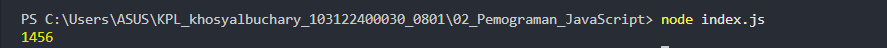

# 📝 Tugas Pendahuluan 02: Pemrograman JavaScript

---

## 👤 Identitas
| Detail | Keterangan |
| :--- | :--- |
| **Nama** | Khosy Albuchary |
| **NIM** | 103122400030 |
| **Kelas** | SE0801 |

---

## ❓ Soal
> Kamu sudah menulis fungsi `mulOfArray`. Ujilah fungsi tersebut dengan input `[2, 0, 26, 28, -2]`, dengan output yang seharusnya adalah **1456**. Jika hasil yang diperoleh berbeda, jelaskan penyebabnya dan perbaiki program tersebut. Jika hasilnya sudah sesuai, jelaskan alasan mengapa program dapat menghasilkan output yang benar.

---

## 💡 Jawaban
Program ini dirancang untuk menghitung total nilai dari seluruh elemen yang tersimpan di dalam sebuah larik atau array.

Logika utamanya bekerja dengan cara menyiapkan sebuah variabel penampung yang dimulai dari angka nol, kemudian melakukan penelusuran satu per satu ke setiap angka yang ada di dalam daftar tersebut. 

Setiap kali menemukan angka baru dalam urutan larik, program akan menambahkannya ke variabel penampung secara kumulatif hingga seluruh data selesai diperiksa, lalu hasil akhir penjumlahannya akan ditampilkan sebagai output utama.

---

## 💻 Kode Sumber
Tersedia pada file [index.js](../index.js)

---

## 🖼️ Output Program

---

## 📖 Deskripsi Program
* **Alat Bantu Numerik:** Aplikasi ini merupakan alat bantu sederhana berbasis logika pemrograman untuk mengolah data numerik dalam bentuk kelompok atau daftar (array).
* **Solusi Otomatis:** Fokus utama dari program ini adalah memberikan solusi cepat dalam menjumlahkan kumpulan angka secara otomatis tanpa harus menghitungnya secara manual.
* **Efisiensi & Akurasi:** Dengan struktur yang efisien, program ini mampu menangani berbagai jumlah data dalam larik dan memastikan akurasi hasil perhitungan total, sehingga sangat berguna untuk dasar pengolahan data statistik atau ringkasan nilai dalam sebuah sistem.

---
