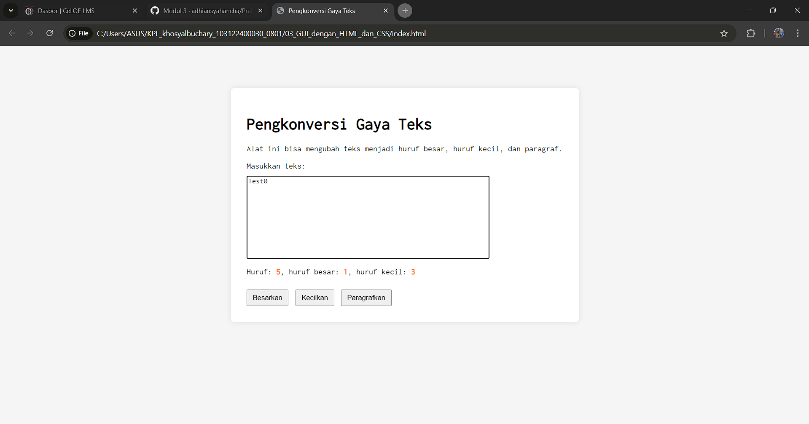

# TP 03 – GUI dengan HTML dan CSS

## Identitas

Nama : Khosy alBuchary

NIM : 103122400030

Kelas : SE-0801

---

# Tugas

Buatlah tata letak laman yang kamu buat berada di tengah, dan juga ubah font-nya dengan Inconsolata dari Google Fonts.

# Struktur Project

```
03_GUI_dengan_HTML_dan_CSS
index.html
index.css
index.js
TP_03_GUI_dengan_HTML_dan_CSS.md
```

---

# Kode Program

## 1. HTML (index.html)

```html
<!DOCTYPE html>
<html lang="id">

<head>
<meta charset="UTF-8">
<title>Pengkonversi Gaya Teks</title>

<link href="https://fonts.googleapis.com/css2?family=Inconsolata&display=swap" rel="stylesheet">

<link rel="stylesheet" href="index.css">
</head>

<body>

<div class="container">

<h1>Pengkonversi Gaya Teks</h1>

<p>Alat ini bisa mengubah teks menjadi huruf besar, huruf kecil, dan paragraf.</p>

<label for="editor-kecil">Masukkan teks:</label>

<textarea id="editor-kecil" class="kotak-input" rows="10" cols="60" placeholder="Kata-kata..."></textarea>

<p>
Huruf: <span id="hf">0</span>,
huruf besar: <span id="hb">0</span>,
huruf kecil: <span id="hk">0</span>
</p>

<div>

<button id="huruf-besar">Besarkan</button>
<button id="huruf-kecil">Kecilkan</button>
<button id="huruf-paragraf">Paragrafkan</button>

</div>

</div>

<script src="index.js"></script>

</body>
</html>
```

---

## 2. CSS (index.css)

```css
body{
font-family: 'Inconsolata', monospace;
display:flex;
justify-content:center;
margin-top:80px;
}

.kotak-input{
display:block;
resize:none;
}

p > span{
color:coral;
font-weight:bold;
}
```

---

## 3. JavaScript (index.js)

```javascript
const editorElement = document.getElementById("editor-kecil")

const charCountElement = document.getElementById("hf")
const hurufBesarElement = document.getElementById("hb")
const hurufKecilElement = document.getElementById("hk")

editorElement.addEventListener("input", () => {

const text = editorElement.value

charCountElement.textContent = text.length

hurufBesarElement.textContent = (text.match(/[A-Z]/g) || []).length

hurufKecilElement.textContent = (text.match(/[a-z]/g) || []).length

})
```

---

# Hasil Program

Program berhasil menampilkan halaman konversi teks yang dapat:

* Menghitung jumlah huruf
* Mengubah teks menjadi huruf besar
* Mengubah teks menjadi huruf kecil
* Mengubah teks menjadi format paragraf

Output



