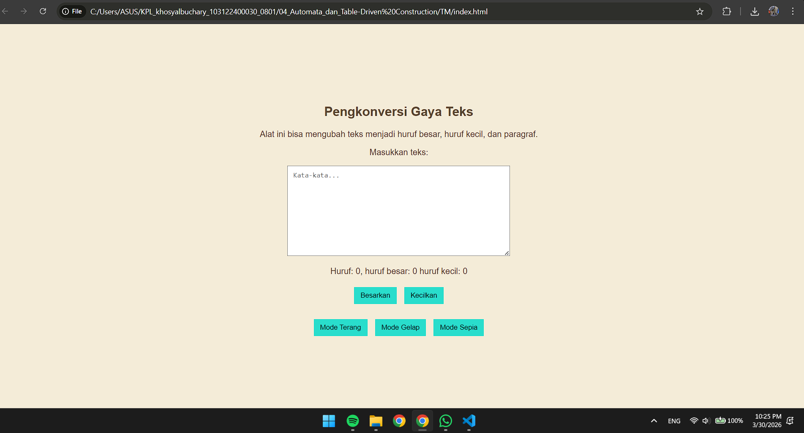

# Tugas Mandiri 04
**Nama :** Khosy AlBuchary  
**NIM :** 103122400030  
**Kelas :** SE-0801  

---

# Tugas
Menambahkan fitur **Mode Sepia** pada aplikasi Pengkonversi Gaya Teks dengan ketentuan:
1. Mengubah warna latar belakang menjadi `#F4ECD8`
2. Mengubah warna teks menjadi `#5B4636`
3. Area input (textarea) tetap berwarna putih
4. Menambahkan tombol **Mode Sepia**
5. Sistem harus menggunakan konsep state:
   - light-mode
   - dark-mode
   - sepia-mode

---

# Program/Kode
Tersedia di:
- [index.html](index.html)
- [style.css](style.css)
- [index.js](index.js)

---

# Output

---

# Deskripsi
Program ini merupakan pengembangan dari aplikasi Pengkonversi Gaya Teks dengan menambahkan fitur Mode Sepia.

Mode Sepia mengubah tampilan aplikasi menjadi warna bernuansa krem dan coklat, sehingga memberikan tampilan yang lebih nyaman di mata. Implementasi fitur ini menggunakan konsep **state (Automata)**, di mana setiap mode (light, dark, sepia) direpresentasikan sebagai state yang berbeda.

Ketika pengguna menekan tombol **Mode Sepia**, sistem akan:
- Menghapus state sebelumnya (light-mode dan dark-mode)
- Menambahkan class `sepia-mode`
- Mengubah tampilan sesuai dengan CSS yang telah ditentukan

Pada mode ini:
- Background berubah menjadi warna krem (`#F4ECD8`)
- Teks berubah menjadi warna coklat (`#5B4636`)
- Area input tetap berwarna putih sesuai dengan ketentuan tugas