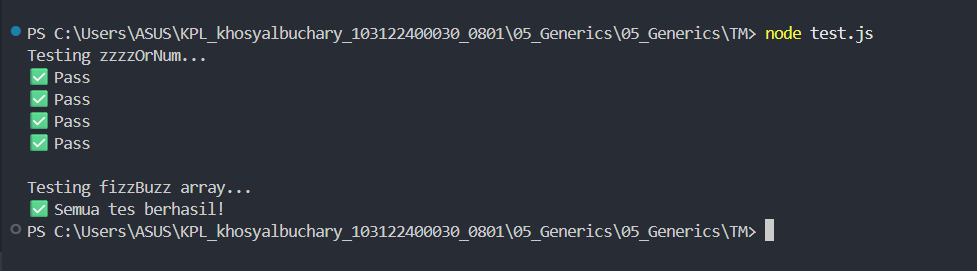

# Tugas Mandiri 05 
**Nama :** Khosy AlBuchary

**NIM :** 103122400030

**Kelas :** SE-0801

# Tugas
Membuat FizzBuzz dengan aturan kali ini adalah:

Fungsi fizzBuzz hanya menerima larik yang semua elemennya terdiri dari bilangan bulat dan mengeluarkan larik pula yang bisa jadi bercampur string dan bilangan 2.Fungsi zzzzOrNum hanya menerima sebuah data tunggal berupa bilangan bulat dan mengembalikan "Fizz", "FizzBuzz", "Buzz", atau bilanga bulat sesuai logikanya 3.Kedua fungsi harus ada dan harus disertai JSDoc sesuai tipe data yang disiratkan dari no. 1, no. 2, dan perilaku yang diharapkan di bawah fizzBuzz harus menggunakan fungsi zzzzOrNum di dalamnya

# Program/Kode
Tersedia di [index.js](index.js)[test.js](test.js)

# Output

# Deskripsi
Membuat fungsi zzzzOrNum untuk memproses angka menjadi string "Fizz", "Buzz", atau "FizzBuzz" berdasarkan aturan kelipatan, sementara fungsi fizzBuzz berperan sebagai aturan yang memetakan array angka menggunakan metode .map() untuk menghasilkan array campuran.