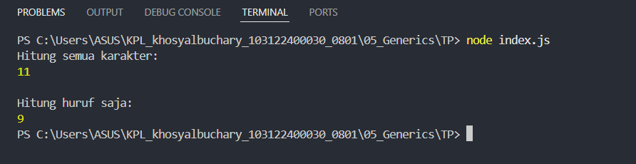

# Tugas Pendahuluan 05 
**Nama :** Khosy AlBuchary

**NIM :** 103122400030

**Kelas :** SE-0801

# Tugas
Bagaimana caramu hanya dengan satu fungsi generik bisa mengurus kode jumlah karakter dan huruf?

# Program/Kode
Tersedia di [index.js](index.js)

# Output

# Deskripsi
Program ini digunakan untuk menghitung jumlah karakter dalam sebuah string, baik seluruh karakter maupun huruf saja (tanpa spasi), menggunakan satu fungsi yang fleksibel (generic)