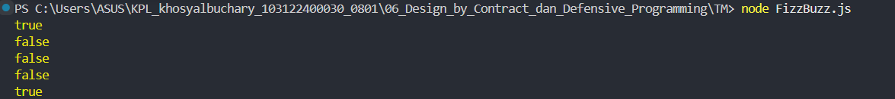

# Tugas Mandiri 06
**Nama :** Khosy AlBuchary

**NIM :** 103122400030

**Kelas :** SE-0801

# Tugas
Terapkanlah fungsi untuk (1) menghitung huruf kecil yang disediakan di #hk, (2) mengubah huruf kecil ke huruf besar ketika pengguna menekan tombol #huruf-besar, dan (3) mengubah huruf besar ke huruf kecil ketika pengguna menekan tombol #huruf-kecil. Kemudian, hapuslah fitur "Paragrafkan" dari alat.

# Program/Kode
Tersedia di [FizzBuzz.js](FizzBuzz.js)

# Output

# Deskripsi
Program ini adalah aplikasi berbasis web yang berfungsi sebagai pengolah teks real-time dengan fitur penghitungan statistik karakter dan transformasi gaya huruf. Menggunakan HTML untuk struktur, CSS untuk tampilan antarmuka yang bersih, dan JavaScript untuk logika interaktif, program ini mampu mendeteksi serta menampilkan jumlah total huruf, jumlah huruf besar, dan jumlah huruf kecil secara otomatis saat pengguna mengetik. Selain itu, pengguna dapat mengubah seluruh format teks menjadi huruf kapital atau huruf kecil secara instan melalui tombol yang tersedia.
