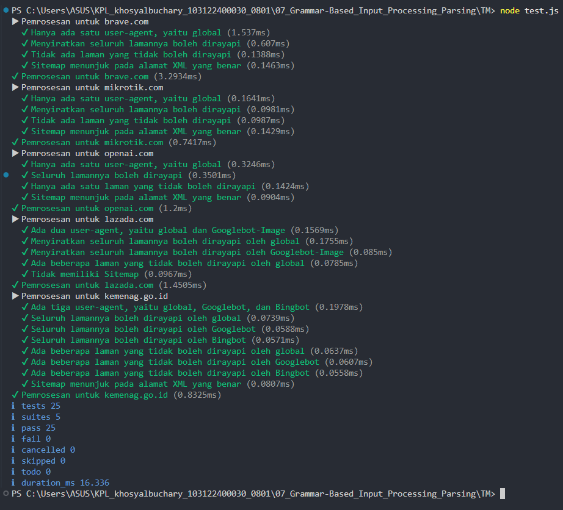

# Tugas Mandiri 07
**Nama :** Khosy AlBuchary

**NIM :** 103122400030

**Kelas :** SE-0801

# Tugas
Membuat fungsi yang menguraikan isi robots.txt menjadi POJO (plain old JavaScript object)

# Program/Kode
Tersedia di [index.js](index.js), [test.js](test.js), [structure.d.ts](structure.d.ts), dan Daftar Robot.txt [Daftar](Daftar)

# Output

# Deskripsi
Program ini mengimplementasikan pemrosesan input berbasis tata bahasa sederhana untuk melakukan konversi tipe data. Logika program dimulai dengan memvalidasi tipe input; jika input berupa string, program akan memecahnya menggunakan metode .split(","). Selanjutnya, setiap elemen diproses menggunakan .map() untuk menghapus spasi kosong (trimming) dan dikonversi menjadi tipe numerik.
Program ini juga memiliki ketahanan data (data robustness) dengan menerapkan filtrasi menggunakan .filter() dan isNaN(), sehingga karakter non-numerik yang tidak sengaja terinput akan dibuang dan hanya menghasilkan larik angka yang valid.
