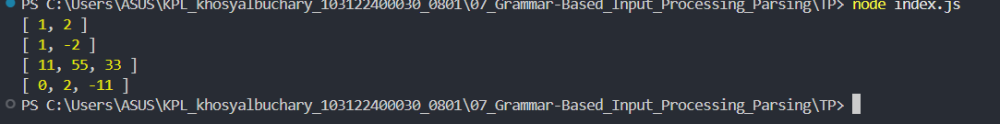

# Tugas Pendahuluan 07
**Nama :** Khosy AlBuchary

**NIM :** 103122400030

**Kelas :** SE-0801

# Tugas
Buatlah fungsi yang mengubah deretan angka bertipe string menjadi larik angka.

# Program/Kode
Tersedia di [index.js](index.js), 

# Output

# Deskripsi
Program ini berfungsi untuk menormalisasi input baik berupa teks (string) maupun daftar kata (array) menjadi kumpulan angka murni dengan cara memecah teks berdasarkan koma, membersihkan spasi yang tidak perlu, dan melakukan konversi tipe data secara otomatis. Melalui proses penyaringan ketat, program ini mampu mengenali angka desimal maupun negatif, sekaligus secara cerdas membuang elemen yang tidak valid (seperti teks "abc23") agar hasil akhirnya hanya berisi nilai numerik yang bersih dan siap digunakan untuk perhitungan lebih lanjut.
