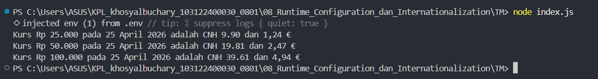

# Tugas Mandiri 08
**Nama :** Khosy AlBuchary

**NIM :** 103122400030

**Kelas :** SE-0801

# Tugas
membuat program yang menampilkan kurs rupiah (IDR) terhadap renminbi luar Tiongkok (CNH) dan euro (EUR). Gunakan link API ini untuk mengambil data.

# Program/Kode
Tersedia di [index.js](index.js), dan file [.env](.env)

# Output

# Deskripsi
Program ini merupakan aplikasi konverter mata uang berbasis Node.js yang mengintegrasikan konsep Runtime Configuration dan Internationalization (i18n). Aplikasi bekerja dengan mengambil data kurs terkini secara real-time dari API eksternal yang URL-nya disimpan dalam variabel lingkungan (.env), kemudian secara otomatis memformat hasil konversi serta tanggal pengambilan data menggunakan objek Intl agar tampil sesuai standar lokal negara Indonesia, Tiongkok, dan Eropa. Dengan pendekatan ini, program tidak hanya akurat dalam perhitungan, tetapi juga memiliki struktur kode yang rapi, aman, dan mudah disesuaikan untuk kebutuhan lintas negara.