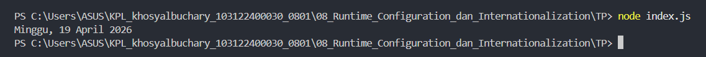

# Tugas Pendahuluan 08
**Nama :** Khosy AlBuchary

**NIM :** 103122400030

**Kelas :** SE-0801

# Tugas
Tampilkan tanggal sekarang dengan format seperti ini: Sabtu, 18 April 2026
Nilai waktu tidak harus sama, asalkan formatnya benar dan bisa tampil di komputer terpisah pada waktu tertentu. Gunakan Intl.DateTimeFormat (bukan string manual).

# Program/Kode
Tersedia di [index.js](index.js), 

# Output

# Deskripsi
Program ini menggunakan objek new Date() untuk mengambil waktu sistem dan API Intl.DateTimeFormat dengan locale 'id-ID' untuk memformatnya ke dalam bahasa Indonesia secara otomatis. Dengan mengatur properti weekday dan month ke mode 'long', program menghasilkan output terstruktur berupa nama hari, tanggal, bulan lengkap, dan tahun yang kemudian ditampilkan melalui konsol.