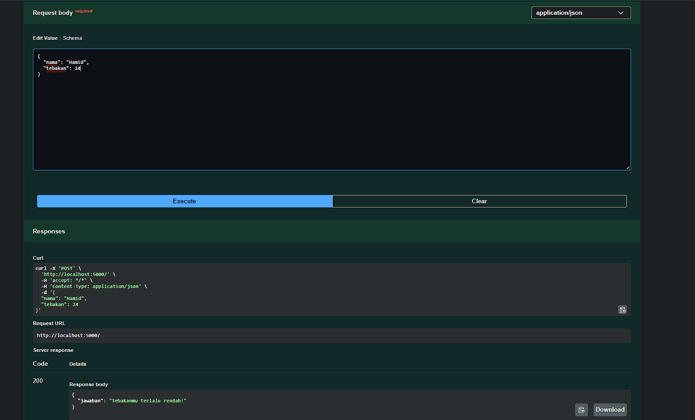
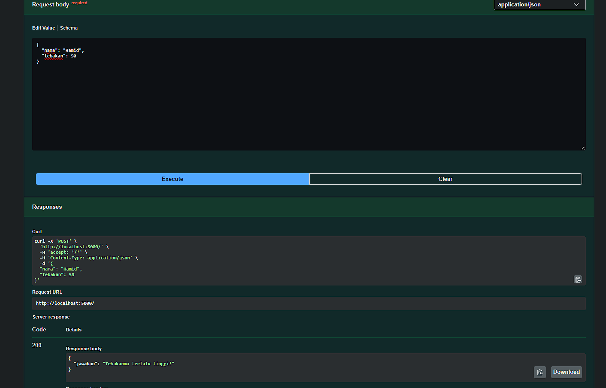
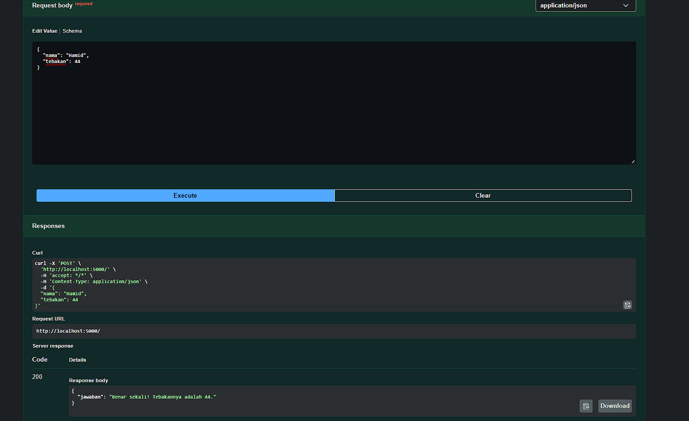

# Tugas Mandiri 09
**Nama :** Khosy AlBuchary

**NIM :** 103122400030

**Kelas :** SE-0801

# Tugas
Buatlah API yang terdiri dari satu endpoint saja, yaitu POST / untuk game tebak-tebakan angka acak dengan aturan angka tetap per nama.

# Program/Kode
Tersedia di [index.js](index.js), 

# Output
, , 

# Deskripsi
Program ini mengimplementasikan logika permainan tebak angka di mana angka target dihasilkan secara konsisten berdasarkan input nama pengguna (hashing). Sistem membandingkan angka tebakan dari body request dengan angka target, lalu memberikan respons apakah tebakan tersebut benar, terlalu rendah, atau terlalu tinggi.