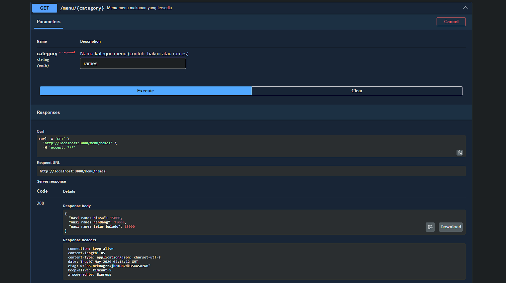
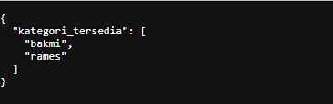

# Tugas Pendahuluan 09
**Nama :** Khosy AlBuchary

**NIM :** 103122400030

**Kelas :** SE-0801

# Tugas
Buatlah satu endpoint lagi beserta dokumentasi OpenAPI-nya, yaitu GET /menu yang menampilkan daftar semua nama kategori menu yang ada.

# Program/Kode
Tersedia di [index.js](index.js)

# Output
, 
  
# Deskripsi
Program ini menggunakan Express.js untuk membuat web server dan Swagger (OpenAPI) untuk dokumentasi otomatis. Endpoint GET /menu berfungsi mengambil semua kunci (keys) dari objek data menu untuk ditampilkan sebagai daftar kategori yang tersedia dalam format JSON.