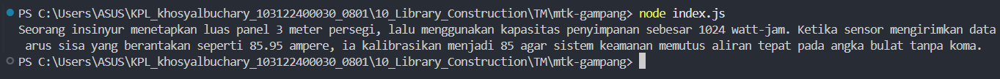

# Tugas Mandiri 10
**Nama :** Khosy AlBuchary

**NIM :** 103122400030

**Kelas :** SE-0801

# Tugas
Pada tugas ini buatlah sebuah proyek baru bernama mtk-gampang

# Program/Kode
Tersedia di [mtk-gampang/index.js](mtk-gampang/index.js) dan modul library di folder [lib/](lib):
- [lib/bulat.js](lib/bulat.js)
- [lib/kuadrat.js](lib/kuadrat.js)
- [lib/pangkat.js](lib/pangkat.js)
# Output

# Deskripsi
Library **mtk-gampang** adalah modul JavaScript berbasis **ES Modules (ESM)** yang dirancang secara modular dengan memisahkan logika fungsi `bulat`, `kuadrat`, dan `pangkat` ke dalam direktori `lib/`, di mana seluruh fungsi tersebut dikelola melalui satu pintu utama di `index.js` menggunakan teknik *re-export* agar dapat diintegrasikan secara efisien pada *entry point* aplikasi untuk menghasilkan kalkulasi narasi teknis yang akurat.