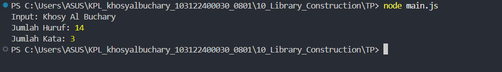

# Tugas Pendahuluan 10
**Nama :** Khosy AlBuchary

**NIM :** 103122400030

**Kelas :** SE-0801

# Tugas
Buatlah pustaka JavaScript yang menyediakan utilitas berupa dua fungsi yang menghitung jumlah huruf dan jumlah kata dengan kriteria alfabet A-Z (besar dan kecil) dan spasi tidak dihitung.

# Program/Kode
Tersedia di [index.js](index.js), dan file [main.js](main.js)

# Output

# Deskripsi
Program ini merupakan implementasi pembuatan library (pustaka) JavaScript menggunakan standar ES Modules (ESM). Terdapat dua fungsi utama yaitu hitungHuruf yang menggunakan Regular Expression untuk menyaring alfabet saja, dan hitungKata untuk memproses string menjadi jumlah kata yang akurat. Pustaka ini dirancang agar dapat diimpor dan digunakan kembali oleh aplikasi lain.